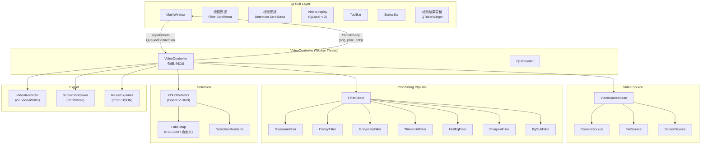
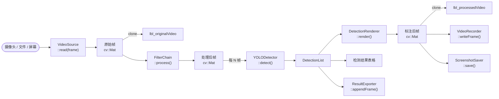
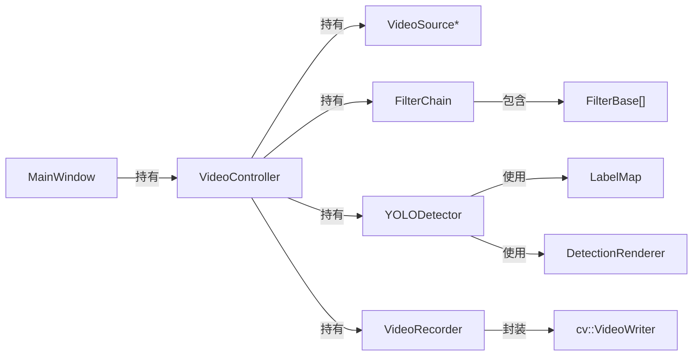

# 系统总体架构图

## 1. 模块分层架构

```mermaid
graph TB
    subgraph GUI["Qt GUI Layer"]
        MW["MainWindow"]
        FP["滤镜面板\nFilter ScrollArea"]
        DP["检测面板\nDetection ScrollArea"]
        VD["VideoDisplay\n(QLabel × 2)"]
        TB["ToolBar"]
        SB["StatusBar"]
        DT["检测结果表格\nQTableWidget"]
    end

    subgraph CTL["VideoController (Worker Thread)"]
        VC["VideoController\n帧循环驱动"]
        FPS["FpsCounter"]
    end

    subgraph SRC["Video Source"]
        VS["VideoSourceBase"]
        CS["CameraSource"]
        FS["FileSource"]
        SS["ScreenSource"]
        VS --> CS
        VS --> FS
        VS --> SS
    end

    subgraph PIPE["Processing Pipeline"]
        FC["FilterChain"]
        GB["GaussianFilter"]
        CV["CannyFilter"]
        GS["GrayscaleFilter"]
        TH["ThresholdFilter"]
        HE["HistEqFilter"]
        SH["SharpenFilter"]
        BS["BgSubFilter"]
        FC --> GB & CV & GS & TH & HE & SH & BS
    end

    subgraph DET["Detection"]
        YD["YOLODetector\n(OpenCV DNN)"]
        LM["LabelMap\n(COCO80 / 自定义)"]
        DR["DetectionRenderer"]
        YD --> LM
        YD --> DR
    end

    subgraph EXP["Export"]
        VR["VideoRecorder\n(cv::VideoWriter)"]
        SS2["ScreenshotSaver\n(cv::imwrite)"]
        RE["ResultExporter\n(CSV / JSON)"]
    end

    MW -- "signals/slots\nQueuedConnection" --> VC
    VC -- "frameReady\n(orig, proc, dets)" --> MW
    VC --> VS
    VC --> FC
    VC --> YD
    VC --> VR
    VC --> SS2
    VC --> RE
```

---

## 2. 数据流向图

```mermaid
flowchart LR
    INPUT(["摄像头 / 文件 / 屏幕"]) 
        --> SRC["VideoSource\n::read(frame)"]
        --> ORIG["原始帧\ncv::Mat"]

    ORIG --> |clone| GUI_ORIG["lbl_originalVideo"]
    ORIG --> FCHAIN["FilterChain\n::process()"]
    FCHAIN --> PROC["处理后帧\ncv::Mat"]

    PROC --> |每 N 帧| YOLO["YOLODetector\n::detect()"]
    YOLO --> DETS["DetectionList"]
    DETS --> RENDER["DetectionRenderer\n::render()"]
    RENDER --> PROC2["标注后帧\ncv::Mat"]

    PROC2 --> |clone| GUI_PROC["lbl_processedVideo"]
    PROC2 --> RECORDER["VideoRecorder\n::writeFrame()"]
    DETS --> TABLE["检测结果表格"]
    PROC2 --> SCREENSHOT["ScreenshotSaver\n::save()"]
    DETS --> EXPORTER["ResultExporter\n::appendFrame()"]
```

---

## 3. 组件依赖关系

```mermaid
graph LR
    MW["MainWindow"] -->|持有| VC["VideoController"]
    VC -->|持有| VS["VideoSource*"]
    VC -->|持有| FC["FilterChain"]
    VC -->|持有| YD["YOLODetector"]
    VC -->|持有| VR["VideoRecorder"]
    FC -->|包含| FB["FilterBase[]"]
    YD -->|使用| LM["LabelMap"]
    YD -->|使用| DR["DetectionRenderer"]
    VR -->|封装| CVW["cv::VideoWriter"]
```
