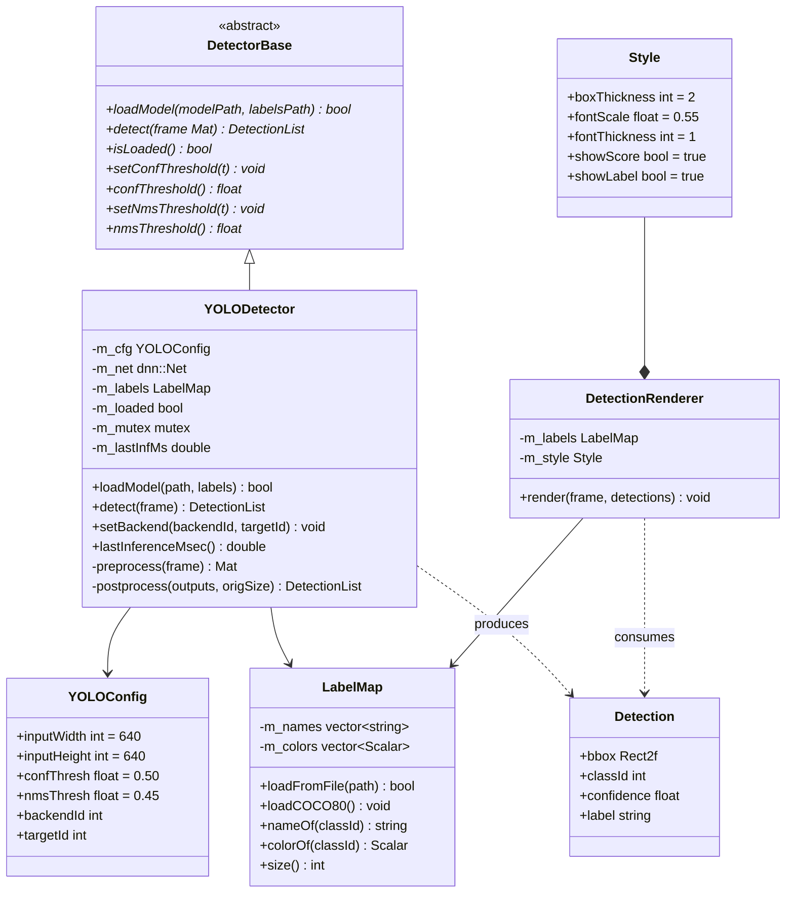
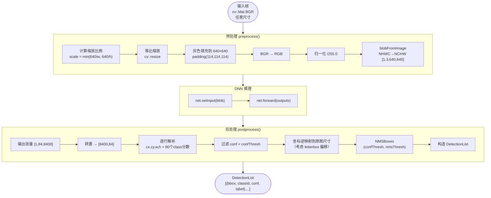
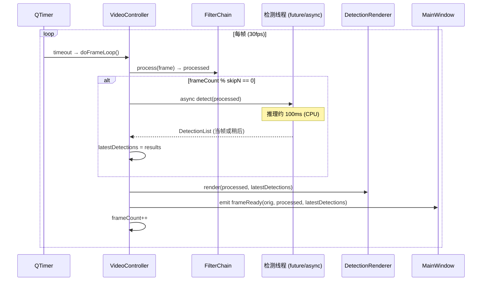
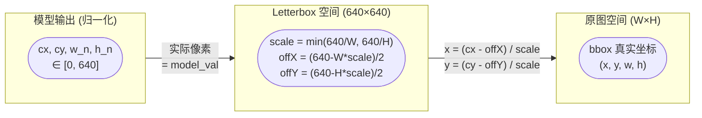
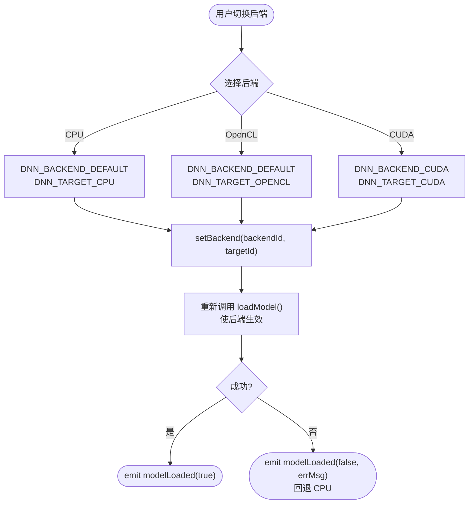

# 目标检测模块类图与推理流程图

## 1. 类关系图

```mermaid
classDiagram
    class DetectorBase {
        <<abstract>>
        +loadModel(modelPath, labelsPath) bool*
        +detect(frame Mat) DetectionList*
        +isLoaded() bool*
        +setConfThreshold(t) void*
        +confThreshold() float*
        +setNmsThreshold(t) void*
        +nmsThreshold() float*
    }

    class YOLODetector {
        -m_cfg YOLOConfig
        -m_net dnn::Net
        -m_labels LabelMap
        -m_loaded bool
        -m_mutex mutex
        -m_lastInfMs double
        +loadModel(path, labels) bool
        +detect(frame) DetectionList
        +setBackend(backendId, targetId) void
        +lastInferenceMsec() double
        -preprocess(frame) Mat
        -postprocess(outputs, origSize) DetectionList
    }

    class YOLOConfig {
        +inputWidth int = 640
        +inputHeight int = 640
        +confThresh float = 0.50
        +nmsThresh float = 0.45
        +backendId int
        +targetId int
    }

    class Detection {
        +bbox Rect2f
        +classId int
        +confidence float
        +label string
    }

    class LabelMap {
        -m_names vector~string~
        -m_colors vector~Scalar~
        +loadFromFile(path) bool
        +loadCOCO80() void
        +nameOf(classId) string
        +colorOf(classId) Scalar
        +size() int
    }

    class DetectionRenderer {
        -m_labels LabelMap
        -m_style Style
        +render(frame, detections) void
    }

    class Style {
        +boxThickness int = 2
        +fontScale float = 0.55
        +fontThickness int = 1
        +showScore bool = true
        +showLabel bool = true
    }

    DetectorBase <|-- YOLODetector
    YOLODetector --> YOLOConfig
    YOLODetector --> LabelMap
    YOLODetector ..> Detection : produces
    DetectionRenderer --> LabelMap
    DetectionRenderer ..> Detection : consumes
    Style --* DetectionRenderer
```

---

## 2. YOLOv8 推理流水线

```mermaid
flowchart TD
    IN(["输入帧\ncv::Mat BGR\n任意尺寸"])

    subgraph PRE["预处理 preprocess()"]
        P1["计算缩放比例\nscale = min(640/w, 640/h)"]
        P2["等比缩放\ncv::resize"]
        P3["灰色填充到 640×640\npadding(114,114,114)"]
        P4["BGR → RGB"]
        P5["归一化 /255.0"]
        P6["blobFromImage\nNHWC→NCHW [1,3,640,640]"]
        P1 --> P2 --> P3 --> P4 --> P5 --> P6
    end

    subgraph INF["DNN 推理"]
        I1["net.setInput(blob)"]
        I2["net.forward(outputs)"]
        I1 --> I2
    end

    subgraph POST["后处理 postprocess()"]
        Q1["输出张量 [1,84,8400]"]
        Q2["转置 → [8400,84]"]
        Q3["逐行解析\ncx,cy,w,h + 80个class分数"]
        Q4["过滤 conf < confThresh"]
        Q5["坐标逆映射到原图尺寸\n（考虑 letterbox 偏移）"]
        Q6["NMSBoxes\n(confThresh, nmsThresh)"]
        Q7["构造 DetectionList"]
        Q1 --> Q2 --> Q3 --> Q4 --> Q5 --> Q6 --> Q7
    end

    IN --> PRE --> INF --> POST

    OUT(["DetectionList\n[{bbox, classId, conf, label},...]"])
    POST --> OUT
```

---

## 3. 跳帧检测时序

```mermaid
sequenceDiagram
    participant TM as QTimer
    participant VC as VideoController
    participant FC as FilterChain
    participant DT as 检测线程 (future/async)
    participant DR as DetectionRenderer
    participant GUI as MainWindow

    loop 每帧 (30fps)
        TM->>VC: timeout → doFrameLoop()
        VC->>FC: process(frame) → processed

        alt frameCount % skipN == 0
            VC->>DT: async detect(processed)
            note over DT: 推理约 100ms (CPU)
            DT-->>VC: DetectionList (当帧或稍后)
            VC->>VC: latestDetections = results
        end

        VC->>DR: render(processed, latestDetections)
        VC->>GUI: emit frameReady(orig, processed, latestDetections)
        VC->>VC: frameCount++
    end
```

---

## 4. 坐标映射示意

```mermaid
flowchart LR
    subgraph ORIG["原图空间 (W×H)"]
        O1(["bbox 真实坐标\n(x, y, w, h)"])
    end

    subgraph LB["Letterbox 空间 (640×640)"]
        L1(["scale = min(640/W, 640/H)\noffX = (640-W*scale)/2\noffY = (640-H*scale)/2"])
    end

    subgraph MODEL["模型输出 (归一化)"]
        M1(["cx, cy, w_n, h_n\n∈ [0, 640]"])
    end

    MODEL -->|"实际像素\n= model_val"| LB
    LB -->|"x = (cx - offX) / scale\ny = (cy - offY) / scale"| ORIG
```

---

## 5. GPU 后端切换流程

```mermaid
flowchart TD
    A([用户切换后端]) --> B{选择后端}
    B -->|CPU| C["DNN_BACKEND_DEFAULT\nDNN_TARGET_CPU"]
    B -->|OpenCL| D["DNN_BACKEND_DEFAULT\nDNN_TARGET_OPENCL"]
    B -->|CUDA| E["DNN_BACKEND_CUDA\nDNN_TARGET_CUDA"]
    C & D & E --> F["setBackend(backendId, targetId)"]
    F --> G["重新调用 loadModel()\n使后端生效"]
    G --> H{成功?}
    H -->|是| I(["emit modelLoaded(true)"])
    H -->|否| J(["emit modelLoaded(false, errMsg)\n回退 CPU"])
```
