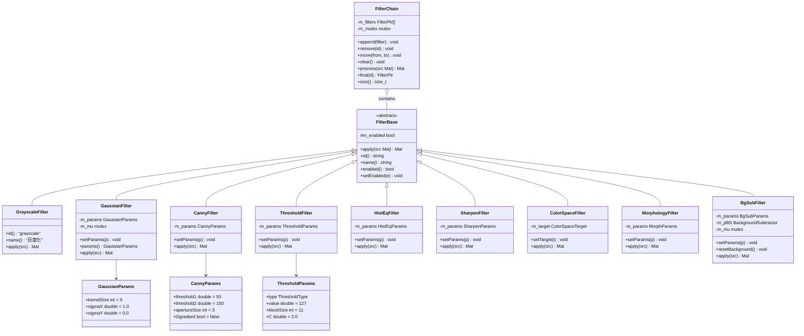
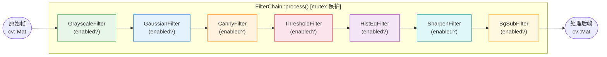
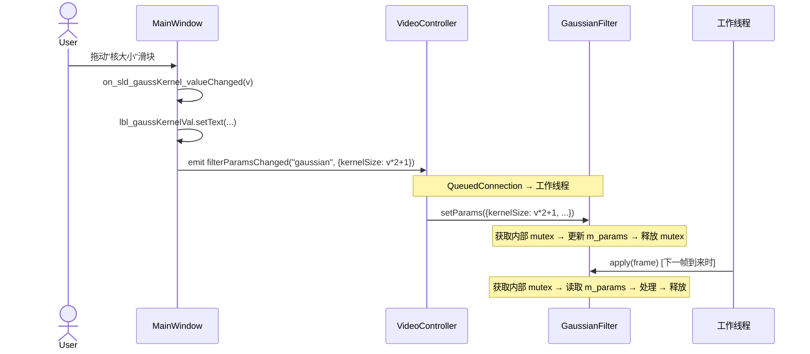

# 图像滤镜模块类图与处理流程图

## 1. 类继承关系

```mermaid
classDiagram
    class FilterBase {
        <<abstract>>
        #m_enabled bool
        +apply(src Mat) Mat*
        +id() string*
        +name() string*
        +enabled() bool
        +setEnabled(e) void
    }

    class FilterChain {
        -m_filters FilterPtr[]
        -m_mutex mutex
        +append(filter) void
        +remove(id) void
        +move(from, to) void
        +clear() void
        +process(src Mat) Mat
        +find(id) FilterPtr
        +size() size_t
    }

    class GrayscaleFilter {
        +id() "grayscale"
        +name() "灰度化"
        +apply(src) Mat
    }

    class GaussianFilter {
        -m_params GaussianParams
        -m_mu mutex
        +setParams(p) void
        +params() GaussianParams
        +apply(src) Mat
    }

    class CannyFilter {
        -m_params CannyParams
        +setParams(p) void
        +apply(src) Mat
    }

    class ThresholdFilter {
        -m_params ThresholdParams
        +setParams(p) void
        +apply(src) Mat
    }

    class HistEqFilter {
        -m_params HistEqParams
        +setParams(p) void
        +apply(src) Mat
    }

    class SharpenFilter {
        -m_params SharpenParams
        +setParams(p) void
        +apply(src) Mat
    }

    class ColorSpaceFilter {
        -m_target ColorSpaceTarget
        +setTarget(t) void
        +apply(src) Mat
    }

    class MorphologyFilter {
        -m_params MorphParams
        +setParams(p) void
        +apply(src) Mat
    }

    class BgSubFilter {
        -m_params BgSubParams
        -m_pBS BackgroundSubtractor
        -m_mu mutex
        +setParams(p) void
        +resetBackground() void
        +apply(src) Mat
    }

    class GaussianParams {
        +kernelSize int = 5
        +sigmaX double = 1.0
        +sigmaY double = 0.0
    }

    class CannyParams {
        +threshold1 double = 50
        +threshold2 double = 150
        +apertureSize int = 3
        +l2gradient bool = false
    }

    class ThresholdParams {
        +type ThresholdType
        +value double = 127
        +blockSize int = 11
        +C double = 2.0
    }

    FilterBase <|-- GrayscaleFilter
    FilterBase <|-- GaussianFilter
    FilterBase <|-- CannyFilter
    FilterBase <|-- ThresholdFilter
    FilterBase <|-- HistEqFilter
    FilterBase <|-- SharpenFilter
    FilterBase <|-- ColorSpaceFilter
    FilterBase <|-- MorphologyFilter
    FilterBase <|-- BgSubFilter
    FilterChain o-- FilterBase : contains
    GaussianFilter --> GaussianParams
    CannyFilter --> CannyParams
    ThresholdFilter --> ThresholdParams
```

---

## 2. 滤镜链处理流程

```mermaid
flowchart LR
    IN(["原始帧\ncv::Mat"])

    subgraph FC["FilterChain::process()  [mutex 保护]"]
        direction TB
        F1["GrayscaleFilter\n(enabled?)"]
        F2["GaussianFilter\n(enabled?)"]
        F3["CannyFilter\n(enabled?)"]
        F4["ThresholdFilter\n(enabled?)"]
        F5["HistEqFilter\n(enabled?)"]
        F6["SharpenFilter\n(enabled?)"]
        F7["BgSubFilter\n(enabled?)"]
        F1 --> F2 --> F3 --> F4 --> F5 --> F6 --> F7
    end

    OUT(["处理后帧\ncv::Mat"])

    IN --> F1
    F7 --> OUT

    style F1 fill:#e8f5e9,stroke:#388e3c
    style F2 fill:#e3f2fd,stroke:#1976d2
    style F3 fill:#fff3e0,stroke:#f57c00
    style F4 fill:#fce4ec,stroke:#c62828
    style F5 fill:#f3e5f5,stroke:#7b1fa2
    style F6 fill:#e0f7fa,stroke:#00838f
    style F7 fill:#fff8e1,stroke:#f9a825
```

---

## 3. 各滤镜算法流程

```mermaid
flowchart TD
    subgraph GS["灰度化 (FLT-01)"]
        gs1["cvtColor BGR→GRAY"] --> gs2["cvtColor GRAY→BGR"]
    end

    subgraph GB["高斯模糊 (FLT-02)"]
        gb1["强制奇数 kernelSize"] --> gb2["GaussianBlur\n(k×k, σ)"]
    end

    subgraph CN["Canny边缘 (FLT-03)"]
        cn1["cvtColor→GRAY"] --> cn2["Canny\n(thresh1, thresh2)"] --> cn3["cvtColor→BGR"]
    end

    subgraph TH["二值化 (FLT-04)"]
        th0{ThresholdType}
        th0 -->|Fixed| th1["threshold\n(value, BINARY)"]
        th0 -->|Adaptive| th2["adaptiveThreshold\n(blockSize, C)"]
        th0 -->|Otsu| th3["threshold\n(0, OTSU)"]
    end

    subgraph HE["CLAHE (FLT-05)"]
        he1["cvtColor BGR→YCrCb"] --> he2["CLAHE on Y channel"] --> he3["cvtColor YCrCb→BGR"]
    end

    subgraph SH["锐化 (FLT-06)"]
        sh1["GaussianBlur(σ)"] --> sh2["addWeighted\nsrc*(1+s), blur*(-s)"]
    end

    subgraph BS["背景差分 (FLT-09)"]
        bs0{Algo}
        bs0 -->|MOG2| bs1["createBackgroundSubtractorMOG2"]
        bs0 -->|KNN| bs2["createBackgroundSubtractorKNN"]
        bs1 & bs2 --> bs3["pBS→apply(src, fgMask)"]
        bs3 --> bs4["cvtColor GRAY→BGR"]
    end
```

---

## 4. 参数热更新时序（以 GaussianFilter 为例）

```mermaid
sequenceDiagram
    actor User
    participant UI as MainWindow
    participant VC as VideoController
    participant GF as GaussianFilter
    participant WT as 工作线程

    User->>UI: 拖动"核大小"滑块
    UI->>UI: on_sld_gaussKernel_valueChanged(v)
    UI->>UI: lbl_gaussKernelVal.setText(...)
    UI->>VC: emit filterParamsChanged("gaussian", {kernelSize: v*2+1})
    note over VC,GF: QueuedConnection → 工作线程

    VC->>GF: setParams({kernelSize: v*2+1, ...})
    note over GF: 获取内部 mutex → 更新 m_params → 释放 mutex

    WT->>GF: apply(frame)  [下一帧到来时]
    note over GF: 获取内部 mutex → 读取 m_params → 处理 → 释放
```
