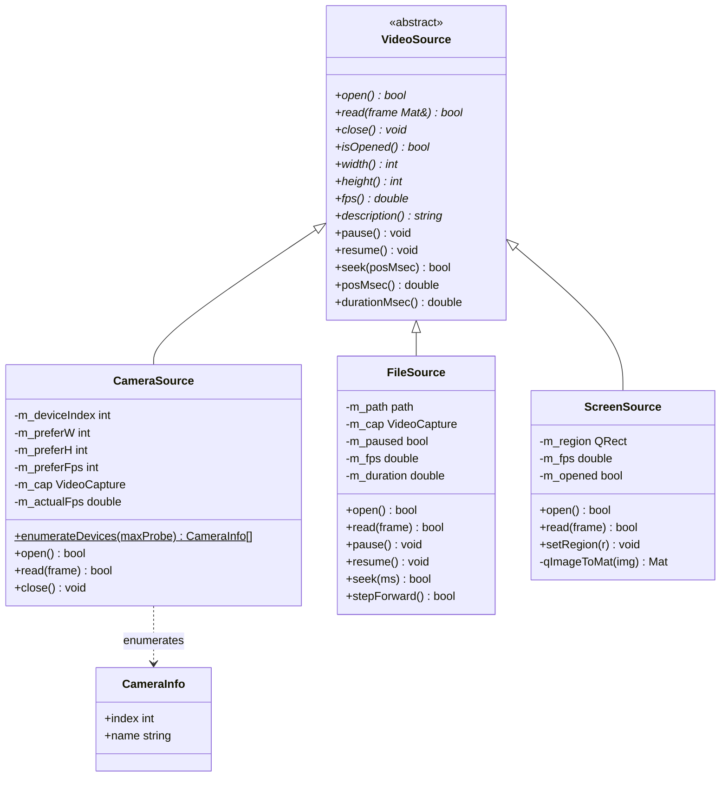
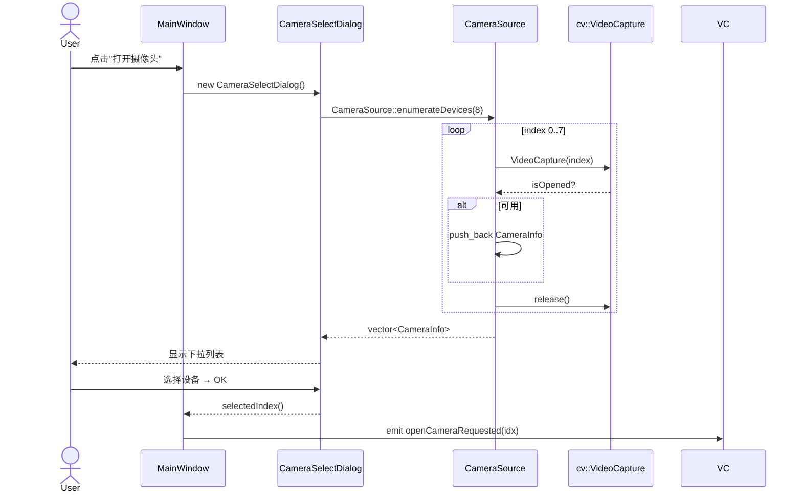
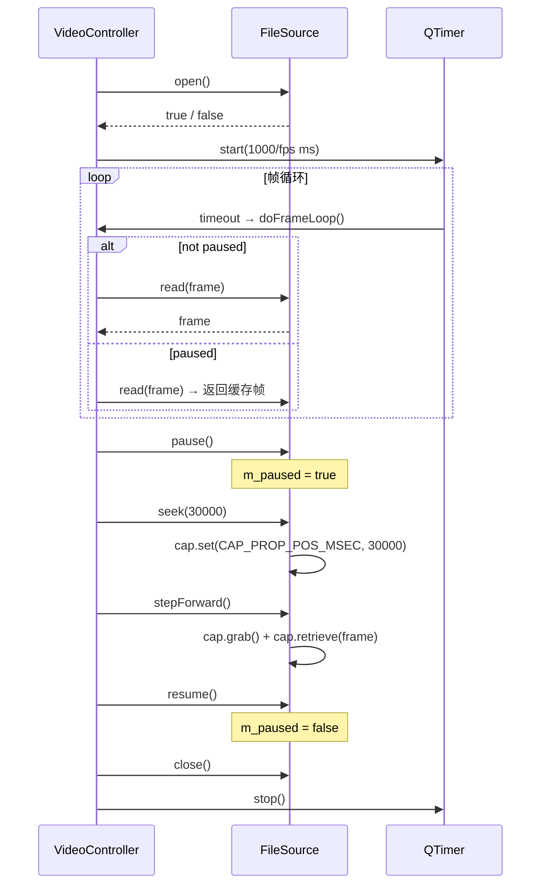

# 视频输入模块类图与时序图

## 1. 类继承关系



---

## 2. 摄像头枚举时序



---

## 3. 文件播放控制时序



---

## 4. 屏幕区域选择流程

```mermaid
flowchart TD
    A([用户点击"屏幕捕获"]) --> B[显示 ScreenRegionSelector\n全屏透明覆窗]
    B --> C{用户操作}
    C -->|拖拽选择区域| D[记录起点和矩形]
    D --> E[实时绘制选择框]
    E --> C
    C -->|释放鼠标| F[emit regionSelected\nQRect]
    C -->|按 Esc| G[取消，返回空 QRect]
    F --> H[ScreenSource::setRegion\nscreen.grabWindow 循环]
    G --> I([结束])
    H --> J([开始捕获帧])
```
