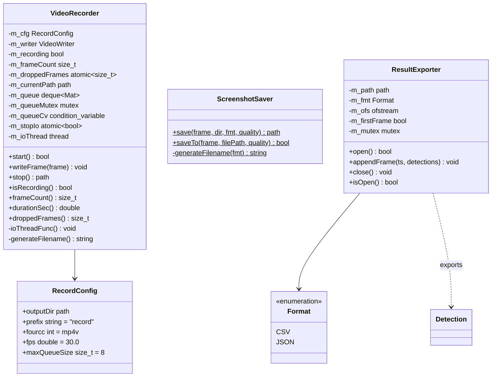
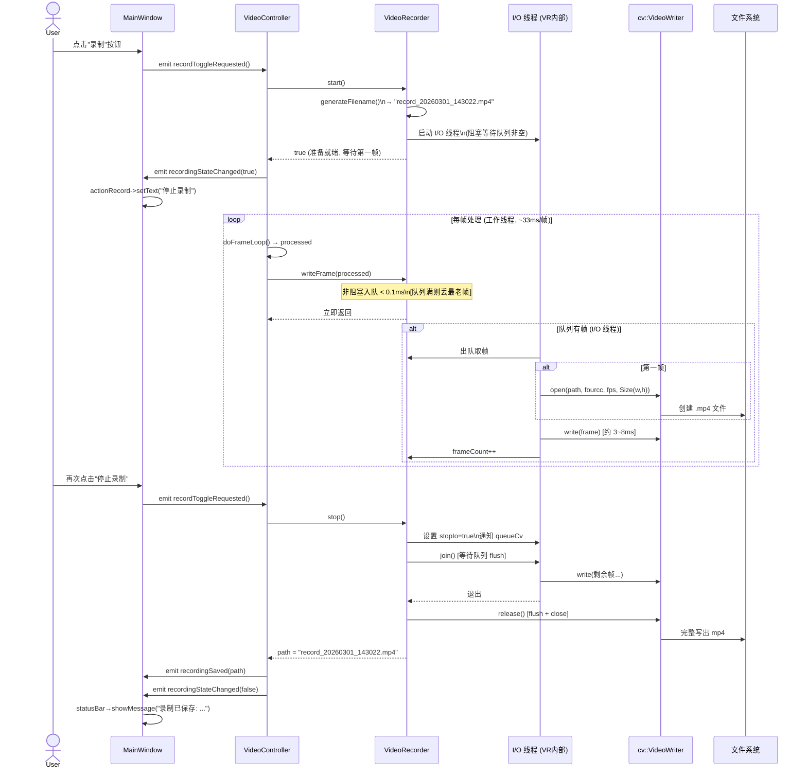
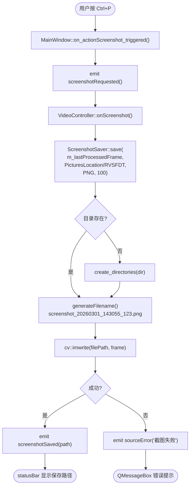
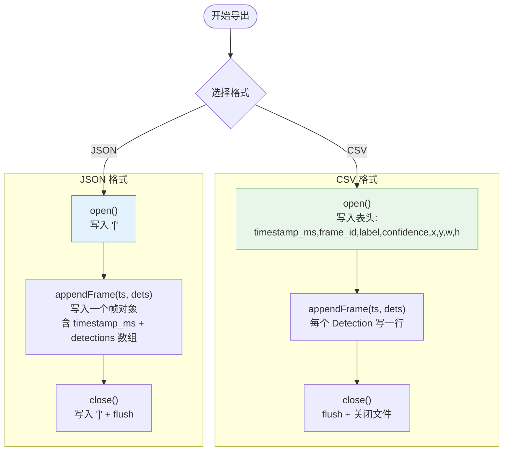
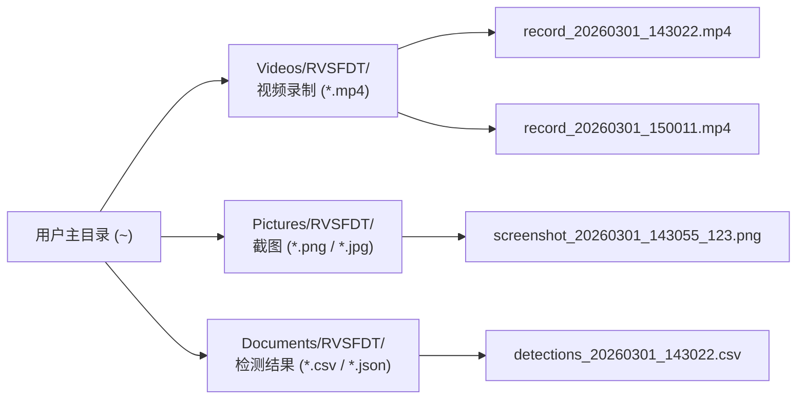
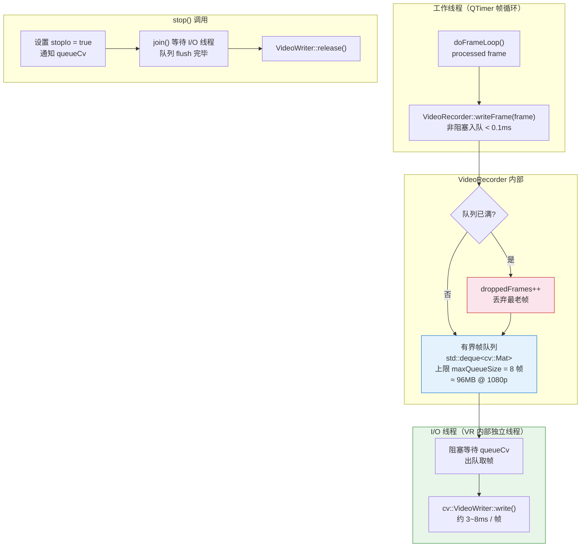

# 录制与导出模块流程图

## 1. 类关系图



---

## 2. 录制状态机

```mermaid
stateDiagram-v2
    [*] --> Idle : 初始化

    Idle : 未录制\nisRecording = false

    Recording : 录制中\nisRecording = true\ncurrentPath = xxx.mp4\nI/O 线程运行中

    Idle --> WaitFirstFrame : start()\n启动 I/O 线程
    WaitFirstFrame --> Recording : writeFrame()\n第一帧入队\n→ I/O 线程打开 VideoWriter
    WaitFirstFrame --> Idle : stop() 提前停止\nI/O 线程退出

    Recording --> Flush : stop()\n设置 stopIo=true\n等待队列清空
    Flush --> Idle : I/O 线程 join()\nVideoWriter::release()\nemit recordingSaved(path)

    Recording --> Recording : writeFrame(frame)\n非阻塞入队 (< 0.1ms)\n[队列满则丢弃最老帧\n+ droppedFrames++]

    state WaitFirstFrame {
        note: 等待第一帧以确定分辨率
    }

    state Flush {
        note: 阻塞等待 I/O 线程写完队列中的剩余帧
    }
```

---

## 3. 录制完整时序



---

## 4. 截图保存流程



---

## 5. 检测结果导出流程（P2）



---

## 6. 输出目录规划



---

## 7. VideoRecorder 内部写队列架构


