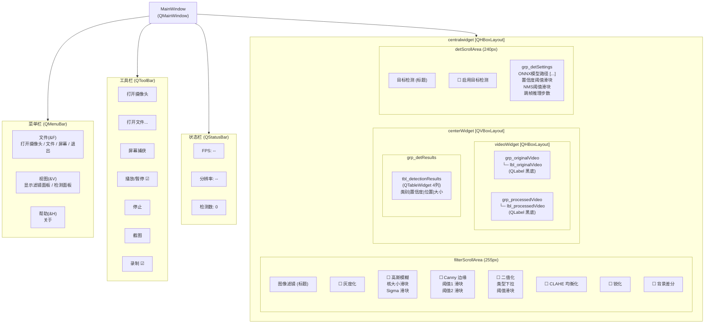
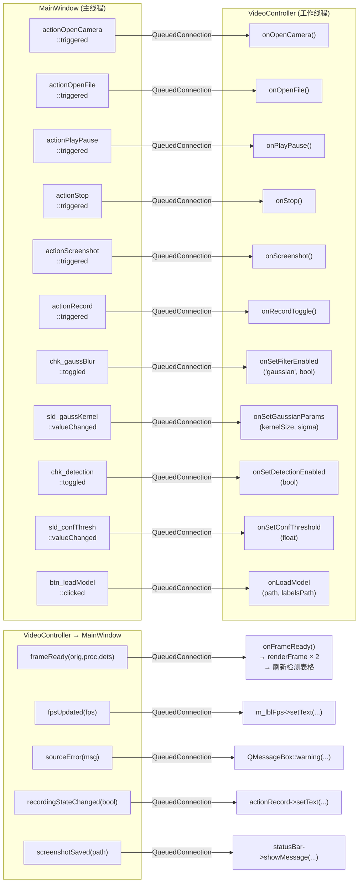
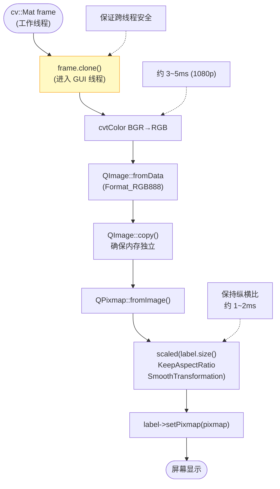
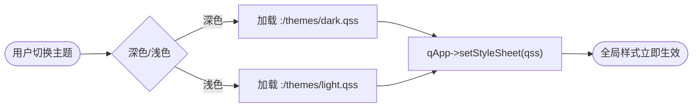

# GUI 模块控件结构与信号槽图

## 1. 控件树结构



---

## 2. 主要信号槽连接



---

## 3. 滤镜参数滑块联动逻辑

```mermaid
stateDiagram-v2
    [*] --> FilterOff : 初始化

    FilterOff : chk = false\n参数面板 disabled
    FilterOn  : chk = true\n参数面板 enabled

    FilterOff --> FilterOn : chk_toggled(true)
    FilterOn  --> FilterOff : chk_toggled(false)

    FilterOn --> SliderDrag : 用户拖动滑块
    SliderDrag --> LabelUpdate : valueChanged(v)
    LabelUpdate --> ParamSignal : emit filterParamsChanged()
    ParamSignal --> ControllerUpdate : VideoController::onSetXxxParams()
    ControllerUpdate --> FilterOn : 下一帧生效
```

---

## 4. 视频帧渲染流程



---

## 5. 主题切换（P2）


