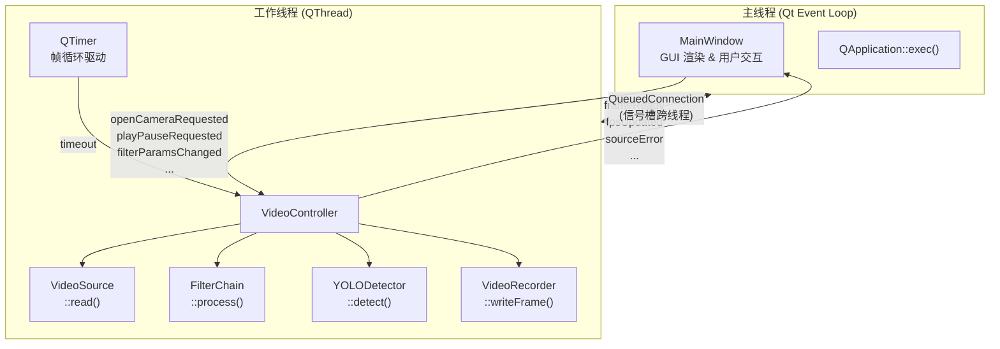
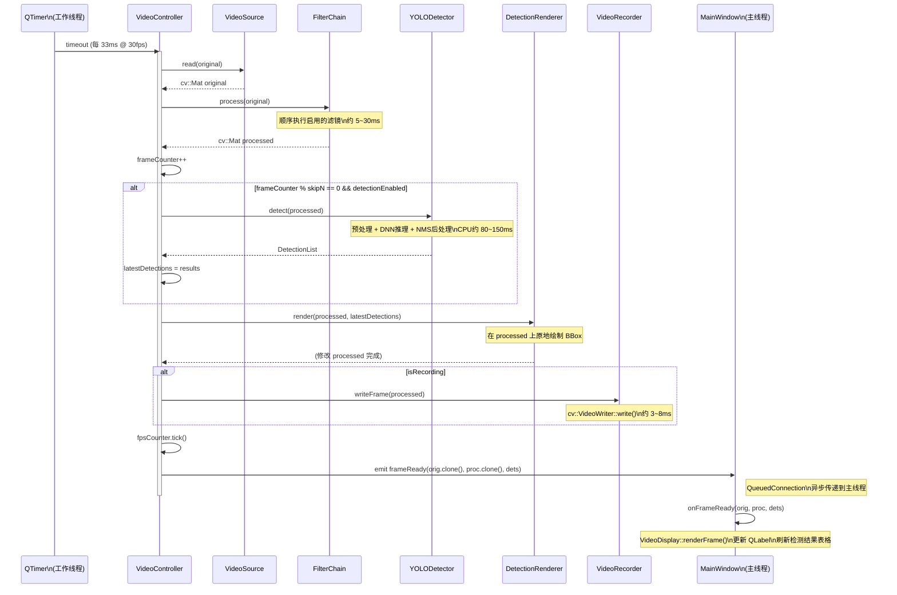
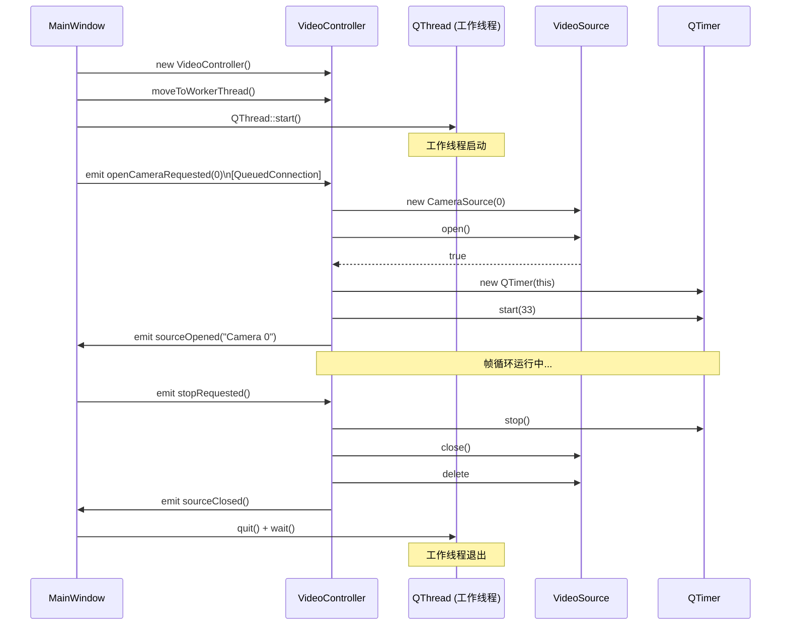
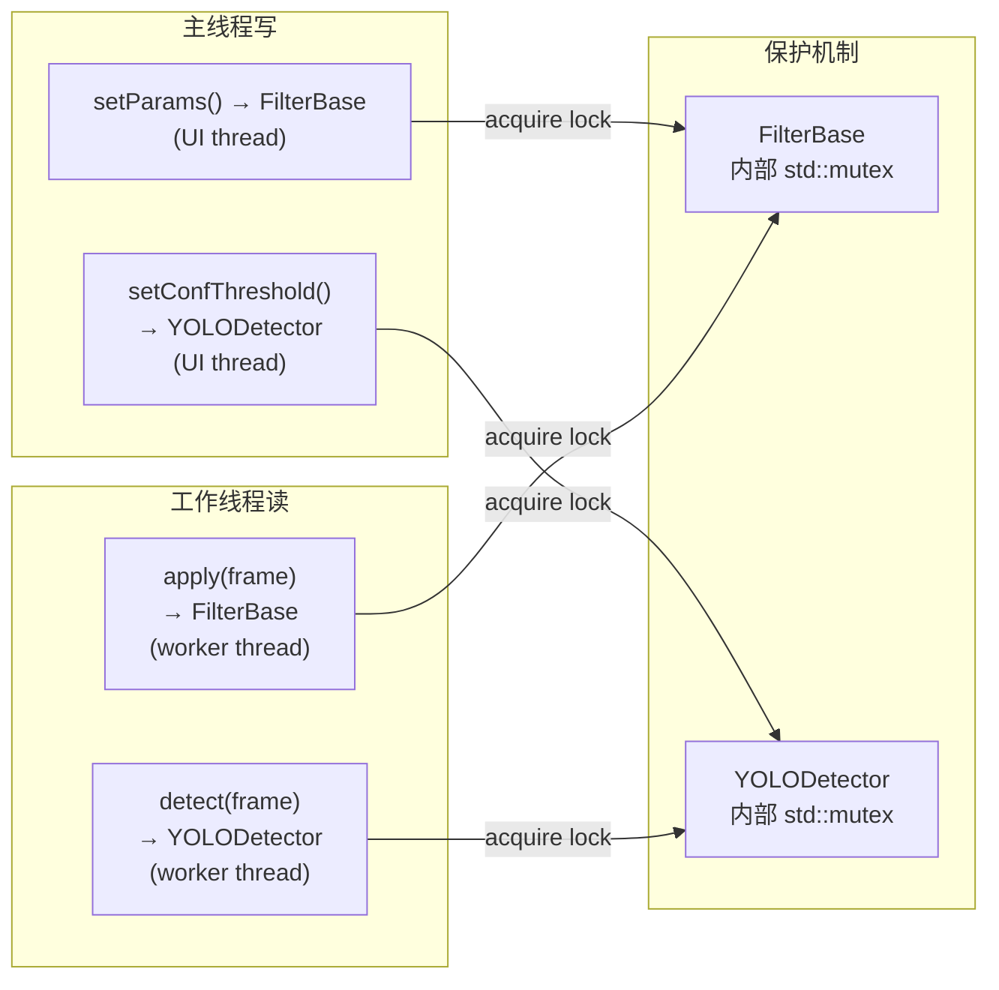
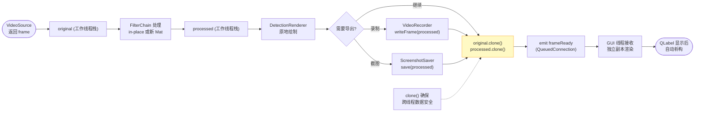

# 线程模型与帧循环详细时序图

## 1. 整体线程架构

```mermaid
flowchart TB
    subgraph MT["主线程 (Qt Event Loop)"]
        MW["MainWindow\nGUI 渲染 & 用户交互"]
        QA["QApplication::exec()"]
    end

    subgraph WT["工作线程 (QThread)"]
        VC["VideoController"]
        TM["QTimer\n帧循环驱动"]
        SRC["VideoSource\n::read()"]
        FC["FilterChain\n::process()"]
        YD["YOLODetector\n::detect()"]
        VR["VideoRecorder\n::writeFrame()"]
    end

    MT <-->|"QueuedConnection\n(信号槽跨线程)"| WT

    MW -- "openCameraRequested\nplayPauseRequested\nfilterParamsChanged\n..." --> VC
    VC -- "frameReady\nfpsUpdated\nsourceError\n..." --> MW

    TM -->|"timeout"| VC
    VC --> SRC
    VC --> FC
    VC --> YD
    VC --> VR
```

---

## 2. 完整帧循环时序

```mermaid
sequenceDiagram
    participant TM as QTimer\n(工作线程)
    participant VC as VideoController
    participant SRC as VideoSource
    participant FC as FilterChain
    participant YD as YOLODetector
    participant DR as DetectionRenderer
    participant VR as VideoRecorder
    participant GUI as MainWindow\n(主线程)

    TM->>VC: timeout (每 33ms @ 30fps)

    activate VC
    VC->>SRC: read(original)
    SRC-->>VC: cv::Mat original

    VC->>FC: process(original)
    note over FC: 顺序执行启用的滤镜\n约 5~30ms
    FC-->>VC: cv::Mat processed

    VC->>VC: frameCounter++

    alt frameCounter % skipN == 0 && detectionEnabled
        VC->>YD: detect(processed)
        note over YD: 预处理 + DNN推理 + NMS后处理\nCPU约 80~150ms
        YD-->>VC: DetectionList
        VC->>VC: latestDetections = results
    end

    VC->>DR: render(processed, latestDetections)
    note over DR: 在 processed 上原地绘制 BBox
    DR-->>VC: (修改 processed 完成)

    alt isRecording
        VC->>VR: writeFrame(processed)
        note over VR: cv::VideoWriter::write()\n约 3~8ms
    end

    VC->>VC: fpsCounter.tick()

    VC->>GUI: emit frameReady(orig.clone(), proc.clone(), dets)
    note right of GUI: QueuedConnection\n异步传递到主线程

    deactivate VC

    GUI->>GUI: onFrameReady(orig, proc, dets)
    note over GUI: VideoDisplay::renderFrame()\n更新 QLabel\n刷新检测结果表格
```

---

## 3. VideoController 启动与关闭时序

```mermaid
sequenceDiagram
    participant MW as MainWindow
    participant VC as VideoController
    participant WK as QThread (工作线程)
    participant SRC as VideoSource
    participant TM as QTimer

    MW->>VC: new VideoController()
    MW->>VC: moveToWorkerThread()
    MW->>WK: QThread::start()

    note over WK: 工作线程启动

    MW->>VC: emit openCameraRequested(0)\n[QueuedConnection]
    VC->>SRC: new CameraSource(0)
    VC->>SRC: open()
    SRC-->>VC: true
    VC->>TM: new QTimer(this)
    VC->>TM: start(33)
    VC->>MW: emit sourceOpened("Camera 0")

    note over TM,VC: 帧循环运行中...

    MW->>VC: emit stopRequested()
    VC->>TM: stop()
    VC->>SRC: close()
    VC->>SRC: delete
    VC->>MW: emit sourceClosed()

    MW->>WK: quit() + wait()
    note over WK: 工作线程退出
```

---

## 4. 跨线程数据安全矩阵

```mermaid
graph LR
    subgraph 主线程写
        UI1["setParams() → FilterBase\n(UI thread)"]
        UI2["setConfThreshold()\n → YOLODetector\n(UI thread)"]
    end

    subgraph 工作线程读
        WT1["apply(frame)\n→ FilterBase\n(worker thread)"]
        WT2["detect(frame)\n→ YOLODetector\n(worker thread)"]
    end

    subgraph 保护机制
        MU1["FilterBase\n内部 std::mutex"]
        MU2["YOLODetector\n内部 std::mutex"]
    end

    UI1 -->|"acquire lock"| MU1
    WT1 -->|"acquire lock"| MU1
    UI2 -->|"acquire lock"| MU2
    WT2 -->|"acquire lock"| MU2
```

---

## 5. 帧数据生命周期

```mermaid
flowchart LR
    A(["VideoSource\n返回 frame"]) 
        --> B["original (工作线程栈)"]
    B --> C["FilterChain 处理\nin-place 或新 Mat"]
    C --> D["processed (工作线程栈)"]
    D --> E["DetectionRenderer\n原地绘制"]
    E --> F{需要导出?}
    F -->|录制| G["VideoRecorder\nwriteFrame(processed)"]
    F -->|截图| H["ScreenshotSaver\nsave(processed)"]
    F -->|继续| I["original.clone()\nprocessed.clone()"]
    G & H --> I
    I --> J["emit frameReady\n(QueuedConnection)"]
    J --> K["GUI 线程接收\n独立副本渲染"]
    K --> L(["QLabel 显示后\n自动析构"])

    style I fill:#fff9c4,stroke:#f9a825
    note1["clone() 确保\n跨线程数据安全"] -.-> I
```
